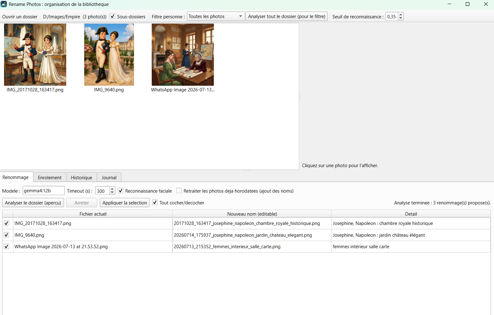
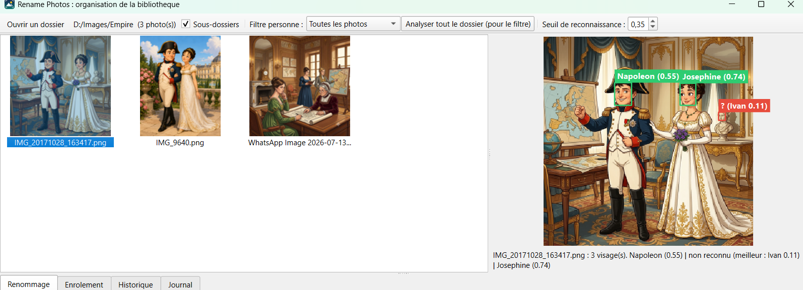

# Local AI Photo Renamer : manuel d'utilisation

Application de renommage intelligent de photos : vos fichiers `IMG_1234.jpg` deviennent `20230703_143551_alice_plage.jpg`, grâce à un modèle vision local (Ollama) qui décrit la scène et à une reconnaissance faciale locale (insightface) qui identifie les personnes que vous lui avez apprises. Tout fonctionne sur votre machine, aucune photo ne quitte l'ordinateur.

*For the English documentation, see [README.md](README.md).*

Remarque : les libellés de l'interface (boutons, onglets) sont écrits sans accents ; ils sont cités tels quels dans ce manuel.





## 1. Prérequis

- **Système** : Windows, Linux ou macOS. Développé et testé sous Windows.
- **Python 3.10 ou plus récent.**
- **[Ollama](https://ollama.com)** pour la description automatique des photos, avec un modèle vision téléchargé (défaut : `gemma4:12b`, environ 8 Go). Évitez `gemma4:e4b` : un bug connu l'empêche de voir les images. Ollama doit tourner pendant l'analyse : soit via l'application de bureau Ollama (démarrée automatiquement avec le système), soit avec `ollama serve` dans un terminal. L'application s'y connecte sur `http://localhost:11434`, l'adresse et le port par défaut d'Ollama ; si votre installation utilise un autre port ou une autre machine (variable `OLLAMA_HOST`), modifiez la constante `OLLAMA_URL` en tête de `rename_photos.py`.
- **Matériel** : 16 Go de RAM recommandés pour le modèle vision (un GPU accélère nettement Ollama mais n'est pas obligatoire). La reconnaissance faciale tourne sur CPU par défaut.
- **Connexion internet au premier lancement uniquement** : téléchargement du modèle Ollama, et du modèle insightface (`buffalo_l`, ~300 Mo) au premier usage des visages. Ensuite tout fonctionne hors ligne.

Ollama et la reconnaissance faciale sont tous deux optionnels : sans Ollama, l'application sait toujours visualiser les photos, gérer les visages et horodater les fichiers au nom déjà explicite ; sans les dépendances de reconnaissance faciale (insightface, onnxruntime, opencv), tout le reste fonctionne aussi.

## 2. Installation

Un environnement virtuel est recommandé, pour isoler les dépendances de votre système Python :

```
:: Windows
python -m venv .venv
.venv\Scripts\activate
pip install -r requirements.txt
ollama pull gemma4:12b

# Linux / macOS
python3 -m venv .venv
source .venv/bin/activate
pip install -r requirements.txt
ollama pull gemma4:12b
```

Un environnement conda convient aussi (`conda create -n photos python=3.12`, puis `conda activate photos` et le même `pip install`).

## 3. Lancement

Environnement activé, lancez simplement :

```
python app_gui.py
```

Sous Windows, `run_app.bat` démarre l'application sans fenêtre de console, mais il utilise le `pythonw` de votre PATH. Si vos dépendances sont dans un venv ou un environnement conda, éditez le fichier et décommentez/adaptez la ligne d'activation en tête (des exemples y figurent). Si rien ne se passe ou qu'un message disparaît trop vite, lancez `run_app_debug.bat` : il garde la console ouverte et affiche l'erreur exacte.

## 4. Vue d'ensemble de la fenêtre

La fenêtre est divisée en deux zones :

En haut : la grille de vignettes (à gauche) et la visionneuse (à droite). Les vignettes se chargent au fur et à mesure du défilement, même avec plusieurs centaines de photos.

En bas : quatre onglets. Renommage (l'analyse et l'application des nouveaux noms), Enrolement (apprendre les visages à l'application), Historique (annuler un lot de renommages), Journal (trace de toutes les opérations).

La barre d'outils du haut regroupe : l'ouverture de dossier, la case "Sous-dossiers", le filtre par personne, le bouton d'analyse complète du dossier, et le seuil de reconnaissance.

## 5. Ouvrir un dossier de photos

Cliquez sur "Ouvrir un dossier..." et choisissez le dossier contenant les photos à renommer. Le nombre de photos s'affiche dans la barre d'outils. Le dernier dossier ouvert est mémorisé et rechargé au prochain démarrage.

La case "Sous-dossiers" inclut récursivement les photos des sous-dossiers (les fichiers renommés restent dans leur sous-dossier d'origine).

## 6. Visionneuse et visages

Cliquez sur une vignette : la photo s'affiche en grand à droite, et la détection de visages se lance automatiquement (le premier usage charge le modèle, comptez quelques secondes ; c'est indiqué dans le Journal).

Chaque visage détecté est encadré :

Cadre vert : visage reconnu. L'étiquette indique le nom et le score de similarité, par exemple "Alice (0.52)".

Cadre rouge : visage non reconnu au seuil actuel. L'étiquette indique le meilleur candidat et son score, par exemple "? (Bob 0.28)". Utile pour repérer les faux négatifs.

Le seuil de reconnaissance (barre d'outils, 0.35 par défaut) se règle en direct : les cadres passent du rouge au vert sans relancer la détection. Baissez-le si des visages connus ne sont pas reconnus, montez-le si des inconnus sont identifiés à tort. Les détections sont mises en cache (`face_cache.json`) : revenir sur une photo déjà analysée est instantané, et changer le seuil ou enrôler quelqu'un ne refait pas la détection.

## 7. Filtre par personne

Le menu "Filtre personne" n'affiche que les photos où apparaît la personne choisie. Le filtre s'appuie sur deux sources : les noms déjà présents dans les noms de fichiers, et les visages déjà analysés (cache).

Les photos jamais analysées ne peuvent pas être filtrées : la barre d'état vous l'indique le cas échéant. Cliquez alors sur "Analyser tout le dossier (pour le filtre)" : l'analyse tourne en arrière-plan (progression dans la barre d'état) et peut prendre plusieurs minutes sur des centaines de photos. Une fois faite, elle est en cache pour de bon.

À ne pas confondre avec "Analyser le dossier (apercu)" de l'onglet Renommage : le bouton de la barre d'outils ne fait que détecter les visages pour alimenter ce filtre (aucun appel au modèle vision, aucune proposition de renommage), tandis que celui de l'onglet Renommage construit les propositions de nouveaux noms (section 8). Les deux partagent le cache de visages : lancer l'un accélère l'autre.

## 8. Renommage (onglet Renommage)

Principe : rien n'est jamais renommé sans votre validation. Le flux est Analyser, puis relire et ajuster, puis Appliquer.

Format des noms produits : `AAAAMMJJ_HHMMSS_description.ext`. L'horodatage vient de l'EXIF, à défaut d'une date présente dans le nom de fichier (formats WhatsApp, Android...), et en dernier recours de la date de modification. La description dépend du nom d'origine :

Nom générique (IMG_1234, IMG-20230703-WA0072, Capture d'écran...) : description générée par le modèle vision. Si la reconnaissance faciale est cochée et reconnaît quelqu'un, son nom remplace les termes génériques et le modèle ne décrit que la scène (ex : `alice_plage` plutôt que `enfant_plage`).

Nom déjà explicite : simple horodatage, sans appel au modèle.

Photo déjà horodatée par un passage précédent : ignorée, sauf si "Retraiter les photos deja horodatees" est coché, auquel cas les noms reconnus sont ajoutés sans toucher à l'horodatage.

Options : modèle Ollama (gemma4:12b par défaut ; attention, gemma4:e4b a un bug connu et ne voit pas les images), timeout par photo (augmentez-le si le modèle charge lentement à froid), reconnaissance faciale, retraitement.

Déroulement :

1. Cliquez "Analyser le dossier (apercu)". La disponibilité d'Ollama et du modèle est vérifiée d'emblée. Les propositions apparaissent ligne par ligne. Les lignes grises sont ignorées (déjà traitées), les rouges sont en erreur, les autres sont proposées et cochées.
2. Relisez. Le "Nouveau nom" est éditable : double-cliquez pour corriger une description ratée. Décochez les lignes à ne pas renommer. "Arreter" interrompt une analyse en cours.
3. Cliquez "Appliquer la selection" et confirmez. Les fichiers sont renommés, le lot est enregistré dans l'historique, la grille se rafraîchit.

## 9. Enrôlement (onglet Enrolement)

Pour apprendre un nouveau visage à l'application, ou compléter une personne existante :

1. Choisissez le nom dans "Personne", ou cliquez "Nouvelle personne..." pour en créer une.
2. Ajoutez 3 à 5 photos de la personne (angles et éclairages variés, visage bien visible), au choix : glisser-déposer dans la zone en pointillés (fichiers ou dossier entier), bouton "Ajouter un dossier..." pour prendre toutes les images d'un dossier, ou bouton "Ajouter des photos..." pour une sélection fichier par fichier.
3. Cliquez "Copier dans Reference/ et enroler". Les photos sont copiées dans `Reference/<nom>/` et les empreintes ajoutées à `faces_db.json`. Rien à préparer : le dossier `Reference/` est créé automatiquement dans le dossier de l'application, à côté de `app_gui.py` (voir l'arborescence, section 12).

Sur chaque photo de référence, c'est le plus grand visage qui est enrôlé : privilégiez des photos où la personne est seule ou clairement au premier plan. Pour un enfant qui grandit, ré-enrôlez périodiquement avec des photos récentes.

## 10. Historique et annulation (onglet Historique)

Chaque application de renommage crée un lot horodaté (les 30 derniers sont conservés dans `rename_history.json`). L'onglet liste les lots avec le détail des fichiers. "Annuler le dernier lot" restaure les anciens noms, après confirmation. Les lots s'annulent un par un, du plus récent au plus ancien.

## 11. Journal (onglet Journal)

Toutes les opérations y sont tracées en direct : chargement des modèles, temps de réponse d'Ollama, visages reconnus avec leurs scores, renommages, erreurs. C'est le premier endroit où regarder quand quelque chose semble lent ou ne fonctionne pas.

## 12. Fichiers de l'application

Arborescence complète après quelque temps d'utilisation :

```
local-ai-photo-renamer/
├── app_gui.py                 # point d'entrée de l'interface graphique
├── photoapp/                  # modules de l'interface (fenêtre, onglets, workers...)
├── rename_photos.py           # renommage en ligne de commande
├── enroll_faces.py            # enrôlement en ligne de commande
├── requirements.txt
├── run_app.bat                # lanceur Windows sans console
├── run_app_debug.bat          # lanceur Windows avec console (erreurs visibles)
├── app_icon.ico, app_icon.png
│
│   Créés automatiquement à l'usage (exclus du dépôt par le .gitignore) :
├── Reference/
│   ├── Alice/                 # photos de référence d'Alice
│   └── Bob/
├── faces_db.json              # empreintes des visages enrôlés
├── face_cache.json            # cache des détections
└── rename_history.json        # historique des lots de renommage
```

Aucun de ces dossiers n'est à créer à la main : l'application les génère au besoin, toujours dans son propre dossier (quel que soit le dossier de photos ouvert).

| Fichier | Rôle |
| --- | --- |
| `app_gui.py` + `photoapp/` | L'application graphique |
| `rename_photos.py`, `enroll_faces.py` | Versions en ligne de commande du renommage et de l'enrôlement (utilisables sans l'interface, `--help` pour les options) |
| `faces_db.json` | Base des empreintes de visages (générée par l'enrôlement) |
| `face_cache.json` | Cache des détections (supprimable sans risque, il se reconstruira) |
| `rename_history.json` | Historique des lots de renommage |
| `Reference/<nom>/` | Photos de référence par personne |

Ces quatre derniers éléments contiennent des données personnelles (photos, empreintes biométriques) : ils sont générés localement et exclus du dépôt par le `.gitignore`.

## 13. Problèmes courants

L'application ne se lance pas : utilisez `run_app_debug.bat` et lisez l'erreur affichée.

"Impossible de contacter Ollama" pendant l'analyse : Ollama ne tourne pas (lancez l'application Ollama ou `ollama serve`) ou n'écoute pas sur `localhost:11434` (voir Prérequis). Relancez ensuite l'analyse. Test rapide : ouvrez `http://localhost:11434` dans un navigateur, la page doit répondre "Ollama is running".

Le modèle n'est pas installé : `ollama pull gemma4:12b` (le nom exact est indiqué dans le message d'erreur).

Timeout sur les premières photos : le modèle vision charge à froid ; augmentez le timeout (600 s) ou relancez, il sera chargé.

Visage connu non reconnu : baissez le seuil et observez les scores dans la visionneuse ; si le score reste très bas, enrôlez des photos de référence supplémentaires plus proches (âge, angle, lunettes...).

Personne absente du filtre : la base de visages ne la connaît pas encore (onglet Enrolement), ou les photos n'ont pas été analysées (bouton "Analyser tout le dossier").
